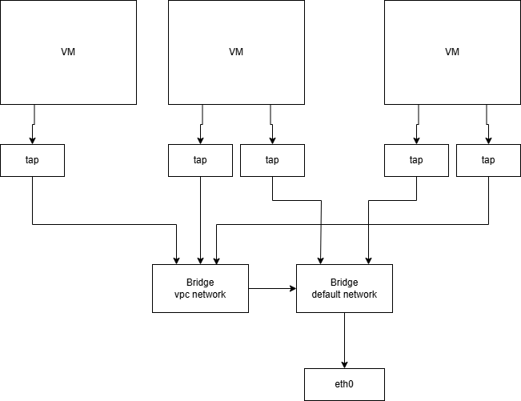

# CH Monitor
This project is a virtual machine monitor for vms created with Cloud-Hypervisor.
This monitor is meant to be installed on Linux OSes hosts and should be used to control the lifecycle of each vm running on the machine.
## The basic idea
This monitor should be installed on a lightweight Linux OS along with a Cloud-Hypervisor binary to manage the lifecycle of all virtual machines running on the system. From disk upload of a guest vm, to REST commands for creating, or booting virtual machines. In the future there is a plan to implement eBPF filters to hide packets between virtual machines (e.g. broadcast packets).
## Features
1. REST api to upload vm disks
2. REST api to forward commands from clients to cloud-hypervisor sockets
3. Go-based CLI to interact with CH Monitor for disks upload

## Network schema

When ch-monitor is started, a default bridge should already exists and it must be connected to a nic. 
Each VM can have one or more ip addresses on the same default network and all of
them pass through the same tap interface connected to the default bridge. 
Each VM can also be connected to one or more vpc networks that are isolated by Tenant ID. VPC can be connected to remote bare-metal where other vpc host are hosted and the connection happen via VxLAN between "Bridge vpc network" and "Bridge default network"